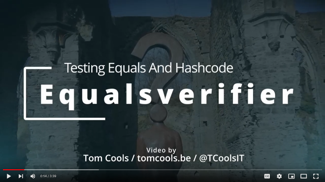

# EqualsVerifier

[](https://github.com/jqno/equalsverifier/actions)
[](https://isitmaintained.com/project/jqno/equalsverifier "Average time to resolve an issue")
[](https://github.com/jqno/equalsverifier/blob/master/LICENSE.md)
[](https://maven-badges.herokuapp.com/maven-central/nl.jqno.equalsverifier/equalsverifier/)
[](https://javadoc.io/doc/nl.jqno.equalsverifier/equalsverifier)

**EqualsVerifier** can be used in Java unit tests to verify whether the contract for the equals and hashCode methods in a class is met.

# Getting Started

EqualsVerifier's Maven coordinates are:

```xml
<dependency>
    <groupId>nl.jqno.equalsverifier</groupId>
    <artifactId>equalsverifier</artifactId>
    <version>4.3</version>
    <scope>test</scope>
</dependency>
```

(Note that there's also a 'fat' jar with no transitive dependencies with artifactId `equalsverifier-nodep`.)

Now you can write a test:

```java
import nl.jqno.equalsverifier.*;

@Test
public void equalsContract() {
    EqualsVerifier.forClass(Foo.class).verify();
}
```

EqualsVerifier is an opinionated library, which means that it can be quite strict. If you feel it's too much, you can make it more lenient:

```java
import nl.jqno.equalsverifier.*;

@Test
public void equalsContract() {
    EqualsVerifier.simple().forClass(Foo.class).verify();
}
```

This way, EqualsVerifier will throw less errors at you. However, it's usually better to just fix the errors: EqualsVerifier throws them for a reason!

## Prefer to watch a short video?

[](http://www.youtube.com/watch?v=ivRjf8yvVMk "Video Title")

<small>Video by [Tom Cools](https://twitter.com/TCoolsIT)</small>

## Documentation

For more documentation, see:

- The [changelog](https://github.com/jqno/equalsverifier/blob/main/CHANGELOG.md)
- The [project's website](https://jqno.nl/equalsverifier/)
- The [ARCHITECTURE.md](ARCHITECTURE.md) file

# A note on equality

EqualsVerifier cares about bug-free equality, in Java and in real life. The place where a person happens to be born, the colour of their skin, their gender, or the person they happen to love, must not affect the way they are treated in life. If it does, that's a bug and it should throw an error.

Don't allow bugs in your equality.

🌈🧑🏻‍🤝‍🧑🏾🌍

# Contribution

Pull requests are welcome! If you plan to open one, please also [register an issue](https://github.com/jqno/equalsverifier/issues/new) or [start a discussion](https://github.com/jqno/equalsverifier/discussions/new/choose), so we can discuss it first. It would be a shame to put in a lot of work on something that isn't a good fit for the project. Also, I can help you by giving pointers on where to find certain things.

# Disclaimer

Copyright 2009-2025 Jan Ouwens
